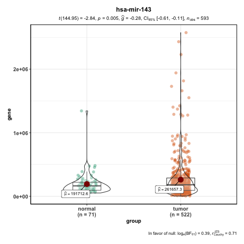
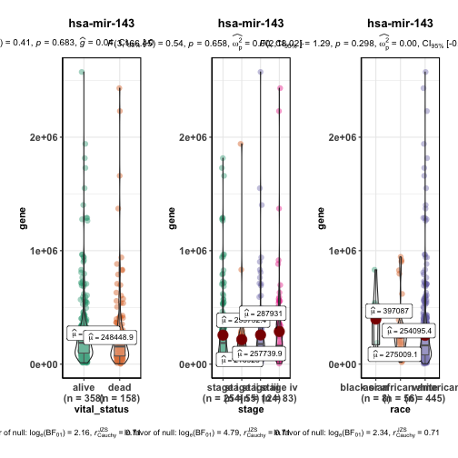
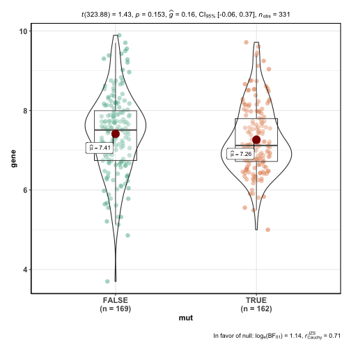

### 0.输入数据


```r
rm(list=ls())
load(file = "for_boxplot.Rdata")
```

这里面有三个数据：

expr和meta是miRNA的表达矩阵和临床信息，由GDC下载整理得到。

mut是突变信息，读取maf得到的数据框筛选了几列得到。

在生信星球公众号回复“box”即可获得。也可参照前面的笔记自己获得。

### 1.比较任意miRNA在tumor和normal样本中的表达量

这个只需要表达矩阵，以hsa-mir-143为例画图，可替换为其他任意miRNA。


```r
expr[1:4,1:4]
#>              TCGA-A3-3307-01A-01T-0860-13 TCGA-A3-3308-01A-02R-1324-13
#> hsa-let-7a-1                         5056                        14503
#> hsa-let-7a-2                        10323                        29238
#> hsa-let-7a-3                         5429                        14738
#> hsa-let-7b                          17908                        37062
#>              TCGA-A3-3311-01A-02R-1324-13 TCGA-A3-3313-01A-02R-1324-13
#> hsa-let-7a-1                         8147                         7138
#> hsa-let-7a-2                        16325                        14356
#> hsa-let-7a-3                         8249                         7002
#> hsa-let-7b                          28984                         6909
group_list=ifelse(as.numeric(substr(colnames(expr),14,15)) < 10,'tumor','normal')
table(group_list)
#> group_list
#> normal  tumor 
#>     71    522

library(ggstatsplot)
dat = data.frame(gene = expr["hsa-mir-143",],
                 group = group_list)
ggbetweenstats(data = dat, x = group,  y = gene,title = "hsa-mir-143")
#> Note: Shapiro-Wilk Normality Test for gene: p-value = < 0.001
#> 
#> Note: Bartlett's test for homogeneity of variances for factor group: p-value = < 0.001
#> 
```



### 2.任意miRNA在任意两个分组中的表达量对比----

只要肿瘤样本,522个，只要是可以根据临床信息查到或得到的分组，例如生死、人种、阶段，都可以拿来做分组。

需要注意调整样本顺序，一一对应。


```r
expf = expr[,as.numeric(substr(colnames(expr),14,15)) < 10]
library(stringr)
x1=str_sub(colnames(expf),1,12)
x2=str_to_upper(meta$patient.bcr_patient_barcode)

table(x2 %in% x1)
#> 
#> FALSE  TRUE 
#>    21   516
table(x1 %in% x2)
#> 
#> TRUE 
#>  522
length(unique(x1))
#> [1] 516

#发现一个问题，样本的前12位代表病人的编号，列名是有重复的，为了一对一关系，去重复走起

expf = expf[,!duplicated(str_sub(colnames(expf),1,12))]
x1=str_sub(colnames(expf),1,12)
x2=str_to_upper(meta$patient.bcr_patient_barcode)
table(x2 %in% x1)
#> 
#> FALSE  TRUE 
#>    21   516
meta = meta[x2 %in% x1 ,]
#按照生死、人种、阶段分组看看
table(meta$patient.vital_status)
#> 
#> alive  dead 
#>   358   158
table(meta$patient.stage_event.pathologic_stage)
#> 
#>   stage i  stage ii stage iii  stage iv 
#>       254        55       124        83
table(meta$patient.race)
#> 
#>                     asian black or african american 
#>                         8                        56 
#>                     white 
#>                       445

dat = data.frame(gene = expf["hsa-mir-143",],
                 vital_status = meta$patient.vital_status,
                 stage = meta$patient.stage_event.pathologic_stage,
                 race = meta$patient.race)
p1 = ggbetweenstats(data = dat, x = vital_status,  y = gene,title = "hsa-mir-143")
#> Note: Shapiro-Wilk Normality Test for gene: p-value = < 0.001
#> 
#> Note: Bartlett's test for homogeneity of variances for factor vital_status: p-value = 0.101
#> 
p2 = ggbetweenstats(data = dat, x = stage,  y = gene,title = "hsa-mir-143")
#> Note: 95% CI for effect size estimate was computed with 100 bootstrap samples.
#> 
#> Note: Shapiro-Wilk Normality Test for gene: p-value = < 0.001
#> 
#> Note: Bartlett's test for homogeneity of variances for factor stage: p-value = < 0.001
#> 
p3 = ggbetweenstats(data = dat, x = race,  y = gene,title = "hsa-mir-143")
#> Note: 95% CI for effect size estimate was computed with 100 bootstrap samples.
#> 
#> Note: Shapiro-Wilk Normality Test for gene: p-value = < 0.001
#> 
#> Note: Bartlett's test for homogeneity of variances for factor race: p-value = 0.001
#> 
library(patchwork)
p1+p2+p3
```



### 3.根据某个基因是否突变分组比较某miRNA的表达量


```r
dim(expf)
#> [1] 552 516
head(mut)
#>    Hugo_Symbol Chromosome Start_Position         Tumor_Sample_Barcode
#> 1:    HNRNPCL2       chr1       13115853 TCGA-G6-A8L7-01A-11D-A36X-10
#> 2:       ERMAP       chr1       42842993 TCGA-G6-A8L7-01A-11D-A36X-10
#> 3:        FAAH       chr1       46394349 TCGA-G6-A8L7-01A-11D-A36X-10
#> 4:       EPS15       chr1       51448116 TCGA-G6-A8L7-01A-11D-A36X-10
#> 5:      HMGCS2       chr1      119764248 TCGA-G6-A8L7-01A-11D-A36X-10
#> 6:      NOS1AP       chr1      162367063 TCGA-G6-A8L7-01A-11D-A36X-10
#>        t_vaf            pos
#> 1: 0.2148148  chr1:13115853
#> 2: 0.1650165  chr1:42842993
#> 3: 0.3114754  chr1:46394349
#> 4: 0.1677852  chr1:51448116
#> 5: 0.2539683 chr1:119764248
#> 6: 0.2098765 chr1:162367063
length(unique(str_sub(mut$Tumor_Sample_Barcode,1,12)))
#> [1] 336
table(x1 %in% unique(str_sub(mut$Tumor_Sample_Barcode,1,12)))
#> 
#> FALSE  TRUE 
#>   185   331
#522个样本中有331个有突变信息记录,将这些样本对应的表达矩阵取出来。
expm = expf[,x1 %in% unique(str_sub(mut$Tumor_Sample_Barcode,1,12))]

VHL_mut=substr(as.character(
  as.data.frame( mut[mut$Hugo_Symbol=='VHL','Tumor_Sample_Barcode'])[,1] ),
  1,12)

library(dplyr)
mut  %>% 
  filter(Hugo_Symbol=='VHL')  %>%   
  as.data.frame()  %>% 
  pull(Tumor_Sample_Barcode)   %>%  
  as.character()   %>%   
  substr(1,12)
#>   [1] "TCGA-BP-4995" "TCGA-B0-5402" "TCGA-CW-5587" "TCGA-BP-5199"
#>   [5] "TCGA-A3-A8OV" "TCGA-EU-5905" "TCGA-CW-5588" "TCGA-CJ-4912"
#>   [9] "TCGA-AK-3455" "TCGA-BP-5175" "TCGA-A3-3367" "TCGA-B0-5696"
#>  [13] "TCGA-B2-5635" "TCGA-B0-5088" "TCGA-CZ-4853" "TCGA-3Z-A93Z"
#>  [17] "TCGA-BP-5004" "TCGA-B0-5085" "TCGA-A3-3323" "TCGA-CJ-6032"
#>  [21] "TCGA-CJ-6032" "TCGA-B0-5092" "TCGA-A3-A8OX" "TCGA-A3-A8OX"
#>  [25] "TCGA-BP-5196" "TCGA-CJ-5684" "TCGA-B0-5094" "TCGA-CJ-4908"
#>  [29] "TCGA-A3-3373" "TCGA-B0-5691" "TCGA-B0-5692" "TCGA-B0-5812"
#>  [33] "TCGA-CJ-5686" "TCGA-CW-5580" "TCGA-CZ-4856" "TCGA-CW-6093"
#>  [37] "TCGA-BP-4977" "TCGA-B8-5551" "TCGA-A3-3331" "TCGA-CJ-4904"
#>  [41] "TCGA-B0-5075" "TCGA-CZ-5989" "TCGA-B0-5113" "TCGA-B8-A54H"
#>  [45] "TCGA-BP-5173" "TCGA-CZ-5470" "TCGA-BP-5201" "TCGA-BP-4982"
#>  [49] "TCGA-CZ-5459" "TCGA-B0-5120" "TCGA-BP-5181" "TCGA-BP-5198"
#>  [53] "TCGA-CZ-5453" "TCGA-B0-5703" "TCGA-B0-5106" "TCGA-CZ-5987"
#>  [57] "TCGA-BP-5180" "TCGA-BP-4962" "TCGA-CZ-5465" "TCGA-BP-4991"
#>  [61] "TCGA-CZ-5460" "TCGA-A3-3383" "TCGA-A3-3385" "TCGA-B4-5832"
#>  [65] "TCGA-CZ-5458" "TCGA-DV-5567" "TCGA-BP-5178" "TCGA-B0-5710"
#>  [69] "TCGA-B8-5165" "TCGA-CZ-5984" "TCGA-BP-4971" "TCGA-A3-3311"
#>  [73] "TCGA-CJ-4902" "TCGA-EU-5907" "TCGA-MW-A4EC" "TCGA-B8-4148"
#>  [77] "TCGA-B0-4945" "TCGA-BP-5183" "TCGA-EU-5904" "TCGA-BP-5186"
#>  [81] "TCGA-BP-4973" "TCGA-B8-5549" "TCGA-BP-4968" "TCGA-BP-4993"
#>  [85] "TCGA-A3-3376" "TCGA-CW-6090" "TCGA-B8-5164" "TCGA-B2-4101"
#>  [89] "TCGA-CW-5591" "TCGA-G6-A8L6" "TCGA-B0-5077" "TCGA-BP-5010"
#>  [93] "TCGA-B0-5709" "TCGA-B4-5836" "TCGA-CJ-5677" "TCGA-B0-4700"
#>  [97] "TCGA-B0-5102" "TCGA-CZ-5985" "TCGA-CJ-5672" "TCGA-A3-3326"
#> [101] "TCGA-B8-5159" "TCGA-CJ-4903" "TCGA-B2-5639" "TCGA-B0-5115"
#> [105] "TCGA-B0-5705" "TCGA-B0-5108" "TCGA-B0-4842" "TCGA-BP-5191"
#> [109] "TCGA-B0-5081" "TCGA-CJ-4916" "TCGA-A3-3372" "TCGA-B0-4827"
#> [113] "TCGA-B0-4823" "TCGA-B0-5107" "TCGA-CJ-5680" "TCGA-A3-3378"
#> [117] "TCGA-AS-3778" "TCGA-B0-5706" "TCGA-DV-A4VX" "TCGA-CJ-4920"
#> [121] "TCGA-B0-5693" "TCGA-BP-5169" "TCGA-CJ-4900" "TCGA-BP-5009"
#> [125] "TCGA-AK-3444" "TCGA-CZ-5986" "TCGA-B0-5095" "TCGA-B0-5099"
#> [129] "TCGA-BP-4999" "TCGA-B0-5713" "TCGA-BP-4998" "TCGA-CW-5583"
#> [133] "TCGA-A3-3380" "TCGA-BP-4988" "TCGA-BP-5185" "TCGA-CJ-6027"
#> [137] "TCGA-A3-3382" "TCGA-B8-A54J" "TCGA-CJ-5676" "TCGA-A3-A6NI"
#> [141] "TCGA-EU-5906" "TCGA-EU-5906" "TCGA-BP-5006" "TCGA-A3-3316"
#> [145] "TCGA-CJ-4923" "TCGA-B8-5163" "TCGA-BP-5177" "TCGA-BP-5184"
#> [149] "TCGA-BP-4960" "TCGA-B0-5695" "TCGA-A3-3308" "TCGA-BP-5192"
#> [153] "TCGA-B0-5097" "TCGA-G6-A8L8" "TCGA-CJ-6030" "TCGA-BP-5176"
#> [157] "TCGA-MM-A564" "TCGA-BP-5195" "TCGA-BP-4965" "TCGA-BP-5170"
#> [161] "TCGA-BP-4964" "TCGA-B0-5711" "TCGA-B0-5096" "TCGA-CZ-5982"
#> [165] "TCGA-BP-4970" "TCGA-CZ-4859" "TCGA-BP-4989" "TCGA-CJ-6031"
#> [169] "TCGA-BP-4967"


#false 是未突变样本，true是突变样本

tail(rownames(expm))
#> [1] "hsa-mir-944" "hsa-mir-95"  "hsa-mir-96"  "hsa-mir-98"  "hsa-mir-99a"
#> [6] "hsa-mir-99b"
dat=data.frame(gene=log2(expm['hsa-mir-98',]),
               mut= substr(colnames(expm),1,12) %in% VHL_mut)

ggbetweenstats(data = dat, x = mut,  y = gene)
#> Note: Shapiro-Wilk Normality Test for gene: p-value = 0.159
#> 
#> Note: Bartlett's test for homogeneity of variances for factor mut: p-value = 0.031
#> 
```



```r

#可以换个方法，直接计算根据某基因突变与否划分的两组之间表达量是否有差异。
res.aov <- aov(gene ~ as.factor(mut), data = dat)
summary(res.aov)
#>                 Df Sum Sq Mean Sq F value Pr(>F)
#> as.factor(mut)   1   1.81   1.809   2.035  0.155
#> Residuals      329 292.47   0.889
TukeyHSD(res.aov)
#>   Tukey multiple comparisons of means
#>     95% family-wise confidence level
#> 
#> Fit: aov(formula = gene ~ as.factor(mut), data = dat)
#> 
#> $`as.factor(mut)`
#>                  diff        lwr        upr     p adj
#> TRUE-FALSE -0.1479028 -0.3518444 0.05603875 0.1546273
summary(res.aov)[[1]]$`Pr(>F)`[1]
#> [1] 0.1546273
#可以批量计算，哗啦哗啦的。
```

