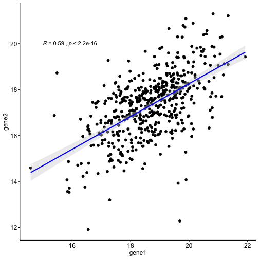
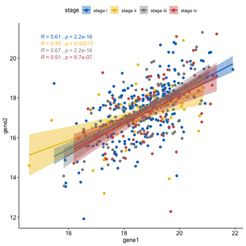
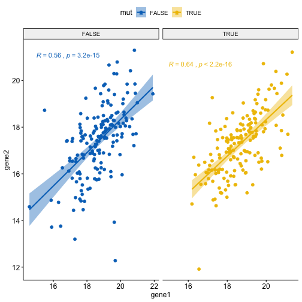
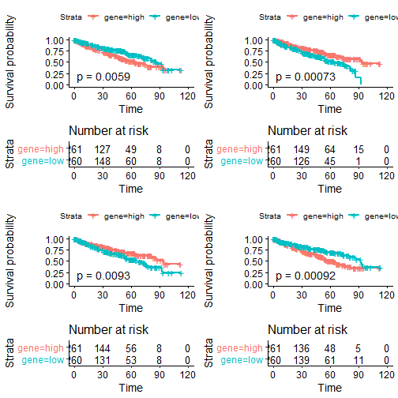

### 0.输入数据和R包


```r
rm(list=ls())
library(ggpubr)
library(stringr)
load(file = "for_boxplot.Rdata")
```

这里面有三个数据：

expr和meta是miRNA的表达矩阵和临床信息，由GDC下载整理得到。

mut是突变信息，读取maf得到的数据框筛选了几列得到。

在生信星球公众号回复“box”即可获得。也可参照前面的笔记自己获得。（为什么是box呢，因为和箱线图用的同一个数据，我又懒得改了。）


```r
expf = expr[,as.numeric(substr(colnames(expr),14,15)) < 10]
expf = expf[,!duplicated(str_sub(colnames(expf),1,12))]
x1=str_sub(colnames(expf),1,12)
x2=str_to_upper(meta$patient.bcr_patient_barcode)
meta = meta[x2 %in% x1 ,]
expm = expf[,x1 %in% unique(str_sub(mut$Tumor_Sample_Barcode,1,12))]

VHL_mut=substr(as.character(
  as.data.frame( mut[mut$Hugo_Symbol=='VHL','Tumor_Sample_Barcode'])[,1] ),
  1,12)
```

expf 是表达矩阵expr去掉正常样本后，仅保留肿瘤样本并去重。
expm 是有突变记录的肿瘤样本的表达矩阵。在上一节中有代码过程记录。

### 2.任意两个基因的相关性分析

#### 2.1 简单绘图

使用ggpbur。


```r
dat=data.frame(gene1=log2(expf['hsa-mir-10b',]+1),
               gene2=log2(expf['hsa-mir-143',]+1),
               stage=as.factor(meta$patient.stage_event.pathologic_stage))


sp1 <- ggscatter(dat, x = "gene1", y = "gene2",
                add = "reg.line",  # Add regressin line 
                add.params = list(color = "blue", fill = "lightgray"), # Customize reg. line
                conf.int = TRUE # Add confidence interval
) + stat_cor(method = "pearson", label.x = 15, label.y = 20)
sp1
```



#### 2.2 按照stage分组

不仅stage，任意在meta信息中能找到或生产的分组都可以。


```r
sp2 <- ggscatter( dat, x = "gene1", y = "gene2",
                color = "stage", palette = "jco",
                add = "reg.line", conf.int = TRUE) +  stat_cor(aes(color = stage),label.x = 15 )
sp2
```



#### 2.3 按照是否突变来分组

理论上某个是否突变并不会改变某两个基因的相关性趋势，如果有这种特殊的突变，打乱了两个基因之间正常的相关关系，机制就有了。可以写循环试一下是否有这样的基因突变。


```r
dat=data.frame(gene1=log2(expm['hsa-mir-10b',]+1),
               gene2=log2(expm['hsa-mir-143',]+1),
               mut= substr(colnames(expm),1,12) %in% VHL_mut)
sp3 <- ggscatter( dat, x = "gene1", y = "gene2",
                color = "mut", palette = "jco",
                add = "reg.line", conf.int = TRUE) +  stat_cor(aes(color = mut),label.x = 15 )
sp3
```


### 3.强迫症闲的没事想给图分身

本以为会很麻烦，打开了前年写的ggplot学习笔记，没想到异常简单。
https://www.jianshu.com/u/c93ac360691a（现在看看，写的什么玩意，不想承认是我写的了。）


```r
sp2  + facet_wrap(~stage, scales = "free_x")
```


```r
sp3  + facet_wrap(~mut, scales = "free_x")
```



### 4.闲的没事还喜欢玩拼图

自从有了patchwork，我拼图来就雄赳赳气昂昂了。


```r
library(patchwork)
sp1 +sp2 +sp3
```



