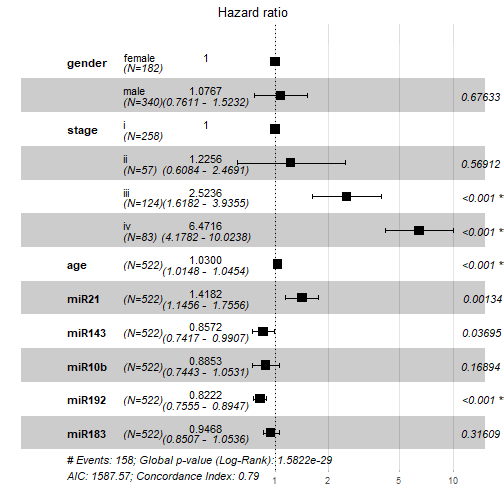
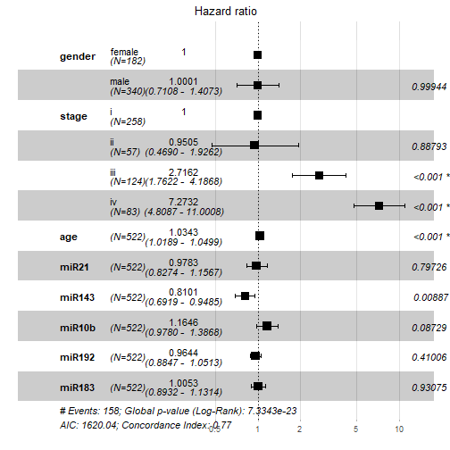

### 1.准备输入数据


```r
load("forest.Rdata")
exprSet = expr[,group_list=="tumor"]
dim(exprSet) ## remove the nomral
#> [1] 552 522
head(meta)
#>                     ID event death last_followup                      race
#> 32.73.0.1 TCGA-A3-3307     0     0          1436                      <NA>
#> 32.73.0.2 TCGA-A3-3308     0     0            16                     white
#> 32.73.0.3 TCGA-A3-3311     1  1191             0                      <NA>
#> 32.73.0.4 TCGA-A3-3313     1   735             0 black or african american
#> 32.73.0.5 TCGA-A3-3316     0     0          1493                     white
#> 32.73.0.6 TCGA-A3-3317     0     0          1491                      <NA>
#>           age gender stage days       time age_group
#> 32.73.0.1  66   male   iii 1436 47.8666667     older
#> 32.73.0.2  77 female   iii   16  0.5333333     older
#> 32.73.0.3  57   male     i 1191 39.7000000   younger
#> 32.73.0.4  59   male     i  735 24.5000000   younger
#> 32.73.0.5  57   male    ii 1493 49.7666667   younger
#> 32.73.0.6  67   male    ii 1491 49.7000000     older
exprSet[1:4,1:4]
#>              TCGA-A3-3307-01A-01T-0860-13 TCGA-A3-3308-01A-02R-1324-13
#> hsa-let-7a-1                         5056                        14503
#> hsa-let-7a-2                        10323                        29238
#> hsa-let-7a-3                         5429                        14738
#> hsa-let-7b                          17908                        37062
#>              TCGA-A3-3311-01A-02R-1324-13 TCGA-A3-3313-01A-02R-1324-13
#> hsa-let-7a-1                         8147                         7138
#> hsa-let-7a-2                        16325                        14356
#> hsa-let-7a-3                         8249                         7002
#> hsa-let-7b                          28984                         6909
head(colnames(exprSet))
#> [1] "TCGA-A3-3307-01A-01T-0860-13" "TCGA-A3-3308-01A-02R-1324-13"
#> [3] "TCGA-A3-3311-01A-02R-1324-13" "TCGA-A3-3313-01A-02R-1324-13"
#> [5] "TCGA-A3-3316-01A-01T-0860-13" "TCGA-A3-3317-01A-01T-0860-13"
head(meta$ID)
#> [1] "TCGA-A3-3307" "TCGA-A3-3308" "TCGA-A3-3311" "TCGA-A3-3313"
#> [5] "TCGA-A3-3316" "TCGA-A3-3317"
## 必须保证生存资料和表达矩阵，两者一致
all(substring(colnames(exprSet),1,12)==meta$ID)
#> [1] TRUE
```

### 2.挑选感兴趣的基因构建coxph模型 

出自文章Integrated genomic analysis identifies subclasses and prognosis signatures of kidney cancer中，五个miRNA是miR-21,miR-143,miR-10b,miR-192,miR-183

将他们从表达矩阵中取出来，就得到了5个基因在522个肿瘤样本中的表达量，可作为列添加在meta表噶的后面,组成的数据框赋值给dat。


```r
e=t(exprSet[c('hsa-mir-21','hsa-mir-143','hsa-mir-10b','hsa-mir-192','hsa-mir-183'),])
e=log2(e)
colnames(e)=c('miR21','miR143','miR10b','miR192','miR183')
dat=cbind(meta,e)
dat$gender=factor(dat$gender)
dat$stage=factor(dat$stage)
colnames(dat)
#>  [1] "ID"            "event"         "death"         "last_followup"
#>  [5] "race"          "age"           "gender"        "stage"        
#>  [9] "days"          "time"          "age_group"     "miR21"        
#> [13] "miR143"        "miR10b"        "miR192"        "miR183"
```

用survival::coxph()函数构建模型


```r
library(survival)
library(survminer)
s=Surv(time, event) ~ gender + stage + age + miR21+miR143+miR10b+miR192+miR183
#s=Surv(time, event) ~ miR21+miR143+miR10b+miR192+miR183
model <- coxph(s, data = dat )
```


### 3.模型可视化-森林图


```r
options(scipen=1)
ggforest(model, data =dat, 
         main = "Hazard ratio", 
         cpositions = c(0.10, 0.22, 0.4), 
         fontsize = 1.0, 
         refLabel = "1", noDigits = 4)
#> Warning: Removed 2 rows containing missing values (geom_errorbar).
```



### 4.模型预测


```r
fp <- predict(model)
summary(model,data=dat)$concordance
#>          C      se(C) 
#> 0.78898350 0.01821821
library(Hmisc)
options(scipen=200)
with(dat,rcorr.cens(fp,Surv(time, event)))
#>         C Index             Dxy            S.D.               n 
#>      0.21101650     -0.57796700      0.03643643    522.00000000 
#>         missing      uncensored  Relevant Pairs      Concordant 
#>      0.00000000    158.00000000  90192.00000000  19032.00000000 
#>       Uncertain 
#> 181754.00000000
# 若要找到最佳模型，我们可以进行变量选择，可以采用逐步回归法进行分析
```

这里只是举个栗子，自己预测自己的C-index是`1-with(dat,rcorr.cens(fp,Surv(time, event)))[[1]]`,实战应该是拿另一个数据集来预测，或者将一个数据集分两半，一半构建模型，一半验证,可以使用机器学习的R包切割数据。

> C-index用于计算生存分析中的COX模型预测值与真实之间的区分度（discrimination），也称为Harrell's concordanceindex。C-index在0.5-1之间。0.5为完全不一致,说明该模型没有预测作用,1为完全一致,说明该模型预测结果与实际完全一致。

### 5.切割数据构建模型并预测

#### 5.1 切割数据

用R包caret切割数据，生成的结果是一组代表列数的数字，用这些数字来给表达矩阵和meta取子集即可。


```r
library(caret)
set.seed(12345679)
sam<- createDataPartition(meta$event, p = .5,list = FALSE)
head(sam)
#>      Resample1
#> [1,]         5
#> [2,]         9
#> [3,]        13
#> [4,]        17
#> [5,]        19
#> [6,]        22
```

可查看两组一些临床参数切割比例


```r
train <- exprSet[,sam]
test <- exprSet[,-sam]
train_meta <- meta[sam,]
test_meta <- meta[-sam,]

prop.table(table(train_meta$stage))
#> 
#>         i        ii       iii        iv 
#> 0.4636015 0.1072797 0.2796935 0.1494253
prop.table(table(test_meta$stage)) 
#> 
#>         i        ii       iii        iv 
#> 0.5249042 0.1111111 0.1954023 0.1685824
prop.table(table(test_meta$race)) 
#> 
#>                     asian black or african american 
#>                0.01171875                0.08593750 
#>                     white 
#>                0.90234375
prop.table(table(train_meta$race)) 
#> 
#>                     asian black or african american 
#>                0.01937984                0.13953488 
#>                     white 
#>                0.84108527
```

#### 5.2 切割后的train数据集建模

和上面的建模方法一样。


```r
e=t(train[c('hsa-mir-21','hsa-mir-143','hsa-mir-10b','hsa-mir-192','hsa-mir-183'),])
e=log2(e)
colnames(e)=c('miR21','miR143','miR10b','miR192','miR183')
dat=cbind(meta,e)
dat$gender=factor(dat$gender)
dat$stage=factor(dat$stage)
colnames(dat)
#>  [1] "ID"            "event"         "death"         "last_followup"
#>  [5] "race"          "age"           "gender"        "stage"        
#>  [9] "days"          "time"          "age_group"     "miR21"        
#> [13] "miR143"        "miR10b"        "miR192"        "miR183"
s=Surv(time, event) ~ gender + stage + age + miR21+miR143+miR10b+miR192+miR183
#s=Surv(time, event) ~ miR21+miR143+miR10b+miR192+miR183
model <- coxph(s, data = dat )
```

#### 5.3 模型可视化


```r
options(scipen=1)
ggforest(model, data =dat, 
         main = "Hazard ratio", 
         cpositions = c(0.10, 0.22, 0.4), 
         fontsize = 1.0, 
         refLabel = "1", noDigits = 4)
#> Warning: Removed 2 rows containing missing values (geom_errorbar).
```




#### 5.4 用切割后的数据test数据集验证模型


```r
e=t(test[c('hsa-mir-21','hsa-mir-143','hsa-mir-10b','hsa-mir-192','hsa-mir-183'),])
e=log2(e)
colnames(e)=c('miR21','miR143','miR10b','miR192','miR183')
test_dat=cbind(meta,e)
```


```r
fp <- predict(model)
summary(model,data=test_dat)$concordance
#>         C     se(C) 
#> 0.7694141 0.0183237
library(Hmisc)
options(scipen=200)
with(test_dat,rcorr.cens(fp,Surv(time, event)))
#>        C Index            Dxy           S.D.              n        missing 
#>      0.2305859     -0.5388283      0.0366474    522.0000000      0.0000000 
#>     uncensored Relevant Pairs     Concordant      Uncertain 
#>    158.0000000  90192.0000000  20797.0000000 181754.0000000
```

C-index为0.7694141，模型还阔以噢。
