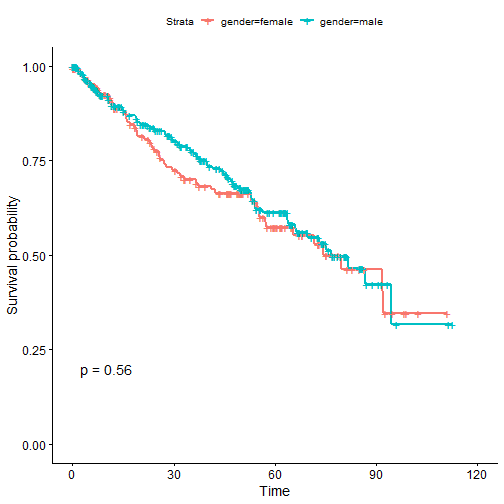
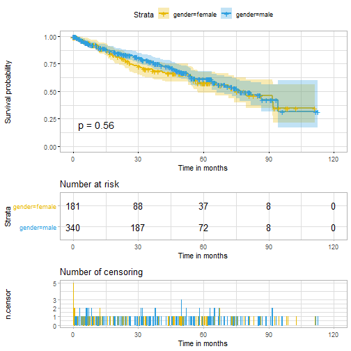
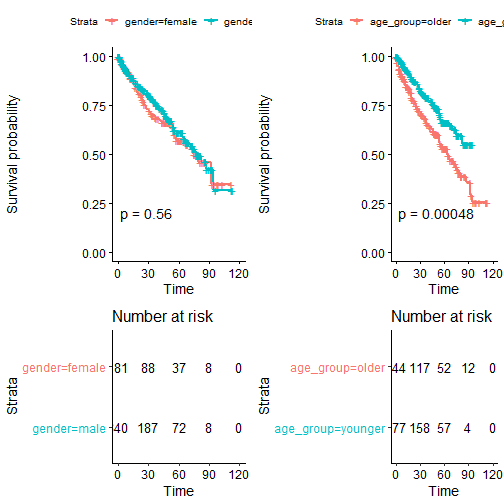
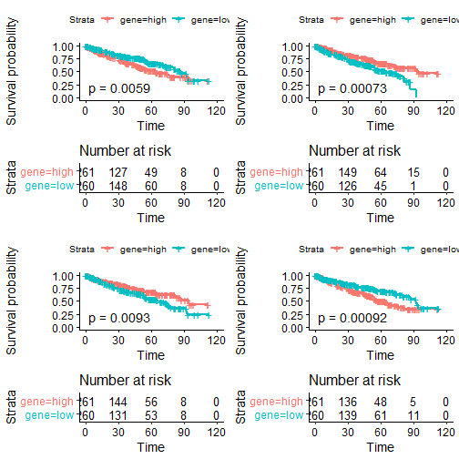
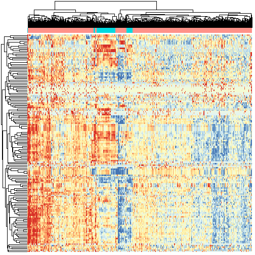
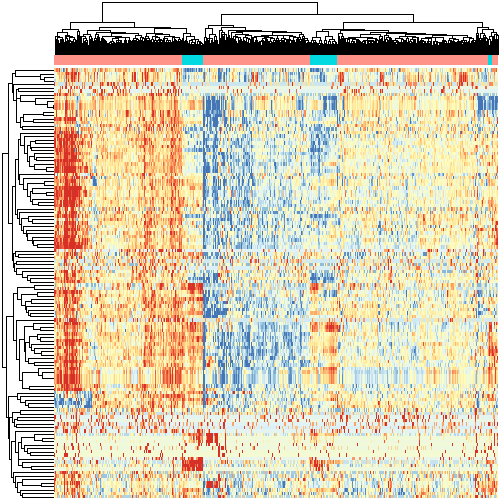
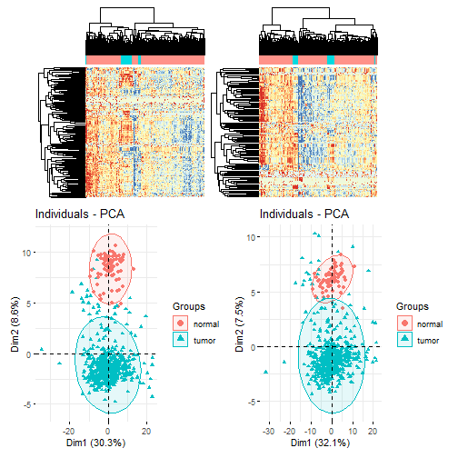

### 1.准备R包


```r
if(!require(survival))install.packages("survival")
if(!require(survminer))install.packages("survminer")
if(!require(stringr))install.packages("stringr")
```

### 2.输入数据

需要表达矩阵expr和临床信息meta。
（变量名无实际意义，但不要轻易修改，改了前面就要改后面，流程很长，改起来麻烦）


```r
rm(list=ls())
options(stringsAsFactors = F)
Rdata_dir='./Rdata/'
Figure_dir='./figures/'
# 加载上一步从RTCGA.miRNASeq包里面提取miRNA表达矩阵和对应的样本临床信息。
load( file = 
        file.path(Rdata_dir,'TCGA-KIRC-miRNA-example.Rdata')
)
dim(expr)
#> [1] 552 593
dim(meta)
#> [1] 537   8
group_list=ifelse(as.numeric(substr(colnames(expr),14,15)) < 10,'tumor','normal')
table(group_list)
#> group_list
#> normal  tumor 
#>     71    522
```

### 3.整理表达矩阵和临床信息

这里做生存分析，已经不需要正常样本的表达矩阵了，所以需要过滤。临床信息需要进行整理。


```r
exprSet=na.omit(expr)
exprSet=exprSet[,group_list=='tumor']
dim(exprSet)
#> [1] 552 522
str(meta)
#> 'data.frame':	537 obs. of  8 variables:
#>  $ patient.bcr_patient_barcode                : chr  "tcga-3z-a93z" "tcga-6d-aa2e" "tcga-a3-3306" "tcga-a3-3307" ...
#>  $ patient.vital_status                       : chr  "alive" "alive" "alive" "alive" ...
#>  $ patient.days_to_death                      : chr  NA NA NA NA ...
#>  $ patient.days_to_last_followup              : chr  "4" "135" "1120" "1436" ...
#>  $ patient.race                               : chr  "black or african american" "black or african american" "white" NA ...
#>  $ patient.age_at_initial_pathologic_diagnosis: chr  "69" "68" "67" "66" ...
#>  $ patient.gender                             : chr  "male" "female" "male" "male" ...
#>  $ patient.stage_event.pathologic_stage       : chr  "stage i" "stage i" "stage i" "stage iii" ...
colnames(meta)=c('ID','event','death','last_followup','race','age','gender','stage')
#调整ID和表达矩阵内容和顺序都一样
head(meta$ID)
#> [1] "tcga-3z-a93z" "tcga-6d-aa2e" "tcga-a3-3306" "tcga-a3-3307" "tcga-a3-3308"
#> [6] "tcga-a3-3311"
meta$ID=str_to_upper(meta$ID) 
meta=meta[match(substr(colnames(exprSet),1,12),meta$ID),]
head(meta$ID)
#> [1] "TCGA-A3-3307" "TCGA-A3-3308" "TCGA-A3-3311" "TCGA-A3-3313" "TCGA-A3-3316"
#> [6] "TCGA-A3-3317"
head(colnames(exprSet))
#> [1] "TCGA-A3-3307-01A-01T-0860-13" "TCGA-A3-3308-01A-02R-1324-13"
#> [3] "TCGA-A3-3311-01A-02R-1324-13" "TCGA-A3-3313-01A-02R-1324-13"
#> [5] "TCGA-A3-3316-01A-01T-0860-13" "TCGA-A3-3317-01A-01T-0860-13"
```

### 4.整理生存分析输入数据


```r
#1.1由随访时间和死亡时间计算生存时间
meta[,3][is.na(meta[,3])]=0
meta[,4][is.na(meta[,4])]=0
meta$days=as.numeric(meta[,3])+as.numeric(meta[,4])
#时间以月份记
meta$time=meta$days/30 
#1.2 根据生死定义event，活着是0，死的是1
meta$event=ifelse(meta$event=='alive',0,1)
table(meta$event)
#> 
#>   0   1 
#> 364 158
#1.3 年龄和年龄分组
meta$age=as.numeric(meta$age)
meta$age_group=ifelse(meta$age>median(meta$age),'older','younger')
table(meta$age_group)
#> 
#>   older younger 
#>     244     278
#1.4 stage
library(stringr) 
meta$stage=str_split(meta$stage,' ',simplify = T)[,2]
table(meta$stage)
#> 
#>   i  ii iii  iv 
#> 258  57 124  83
#1.5 race
table(meta$race)
#> 
#>                     asian black or african american                     white 
#>                         8                        58                       448
```

### 5.生存分析绘图

#### 5.1 简单绘图（性别）


```r
library(survival)
library(survminer)
sfit <- survfit(Surv(time, event)~gender, data=meta)
ggsurvplot(sfit, conf.int=F, pval=TRUE)
```



```r
ggsurvplot(sfit,palette = c("#E7B800", "#2E9FDF"),
           risk.table =TRUE,pval =TRUE,
           conf.int =TRUE,xlab ="Time in months", 
           ggtheme =theme_light(), 
           ncensor.plot = TRUE)
```



#### 5.2 多个生存分析拼图(性别和年龄)


```r
sfit1=survfit(Surv(time, event)~gender, data=meta)
sfit2=survfit(Surv(time, event)~age_group, data=meta)
splots <- list()
splots[[1]] <- ggsurvplot(sfit1,pval =TRUE, data = meta, risk.table = TRUE)
splots[[2]] <- ggsurvplot(sfit2,pval =TRUE, data = meta, risk.table = TRUE)
arrange_ggsurvplots(splots, print = TRUE,  ncol = 2, nrow = 1, risk.table.height = 0.4)
```



```r
dev.off()
#> null device 
#>           1
```

可以很明显看到，肿瘤病人的生存受着诊断癌症的年龄的影响，却与性别无关。

#### 5.3 挑选感兴趣的（多个）基因做生存分析

来自于文章：2015-TCGA-ccRCC-5-miRNAs-signatures
Integrated genomic analysis identifies subclasses and prognosis signatures of kidney cancer
miR-21,miR-143,miR-10b,miR-192,miR-183


```r
gs=c('hsa-mir-21','hsa-mir-143','hsa-mir-192',
     'hsa-mir-183') 
splots <- lapply(gs, function(g){
  meta$gene=ifelse(exprSet[g,]>median(exprSet[g,]),'high','low')
  sfit1=survfit(Surv(time, event)~gene, data=meta)
  ggsurvplot(sfit1,pval =TRUE, data = meta, risk.table = TRUE)
}) 
arrange_ggsurvplots(splots, print = TRUE,  
                    ncol = 2, nrow = 2, risk.table.height = 0.4)
```



### 6 批量生存分析 

#### 6.1 log-rank方法

对每个基因（在这个例子里是miRNA）求了p值。


```r
mySurv=with(meta,Surv(time, event))
log_rank_p <- apply(exprSet , 1 , function(gene){
  # gene=exprSet[1,]
  meta$group=ifelse(gene>median(gene),'high','low')  
  data.survdiff=survdiff(mySurv~group,data=meta)
  p.val = 1 - pchisq(data.survdiff$chisq, length(data.survdiff$n) - 1)
  return(p.val)
})
log_rank_p=sort(log_rank_p)
table(log_rank_p<0.01) 
#> 
#> FALSE  TRUE 
#>   464    88
table(log_rank_p<0.05) 
#> 
#> FALSE  TRUE 
#>   401   151
```

结果是88个基因的p<0.01,151个基因的p<0.05。

#### 6.2 cox方法


```r
cox_results <-apply(exprSet , 1 , function(gene){
  # gene= exprSet[1,]
  group=ifelse(gene>median(gene),'high','low') 
  survival_dat <- data.frame(group=group,stage=meta$stage,age=meta$age,
                             gender=meta$gender,
                             stringsAsFactors = F)
  m=coxph(mySurv ~ gender + age + stage+ group, data =  survival_dat)
  
  beta <- coef(m)
  se <- sqrt(diag(vcov(m)))
  HR <- exp(beta)
  HRse <- HR * se
  
  #summary(m)
  tmp <- round(cbind(coef = beta, se = se, z = beta/se, p = 1 - pchisq((beta/se)^2, 1),
                     HR = HR, HRse = HRse,
                     HRz = (HR - 1) / HRse, HRp = 1 - pchisq(((HR - 1)/HRse)^2, 1),
                     HRCILL = exp(beta - qnorm(.975, 0, 1) * se),
                     HRCIUL = exp(beta + qnorm(.975, 0, 1) * se)), 3)
  return(tmp['grouplow',])
  
})
cox_results=t(cox_results)
table(cox_results[,4]<0.01)
#> 
#> FALSE  TRUE 
#>   492    60
table(cox_results[,4]<0.05)
#> 
#> FALSE  TRUE 
#>   428   124
```

结果是60个基因的p<0.01,124个基因的p<0.05。

### 7.对生存影响显著的基因可视化（热图和PCA）

将p<0.05的基因表达矩阵筛选出来，作图看看


```r
library(pheatmap)
choose_gene_rank=names(log_rank_p[log_rank_p<0.05])
choose_matrix_rank=expr[choose_gene_rank,]
source("3-plotfunction.R")

h1 = draw_heatmap(choose_matrix_rank,group_list)
```



```r
p1 = draw_pca(log(choose_matrix_rank+1),group_list)

choose_gene_cox=rownames(cox_results[cox_results[,4]<0.05,])
choose_matrix_cox=expr[choose_gene_cox,]

h2 = draw_heatmap(choose_matrix_cox,group_list)
```



```r
p2 = draw_pca(log(choose_matrix_cox+1),group_list)
library(patchwork)
(h1 + h2)/(p1+p2)
```



这里的聚类分组不在一起也是正常的，因为选的不是差异基因而是对生死影响显著的基因，和是否癌症组织有一定关系，但不是绝对关系。
